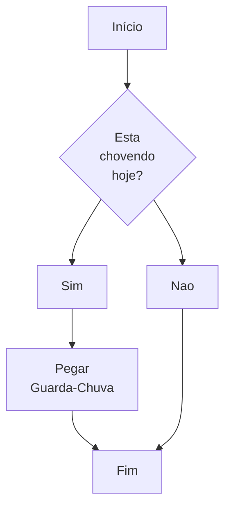
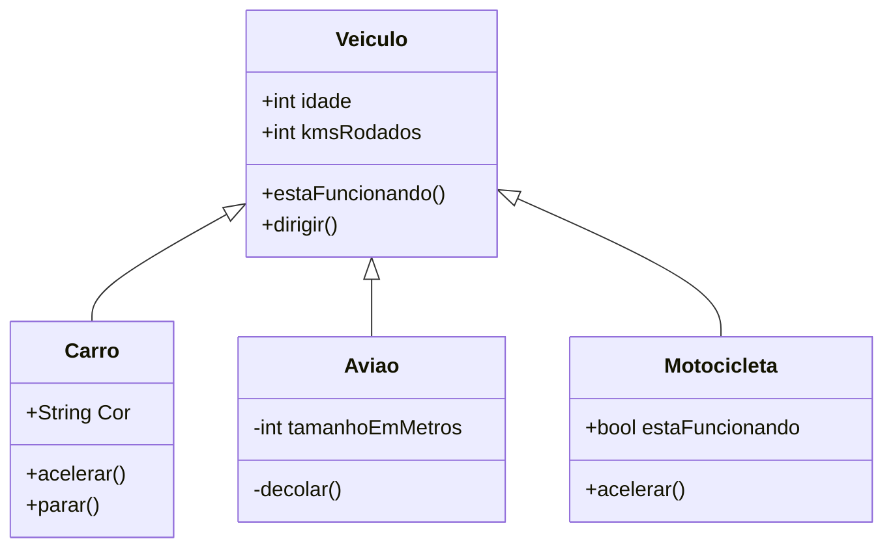
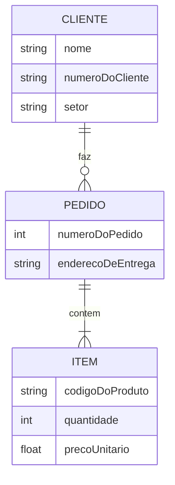
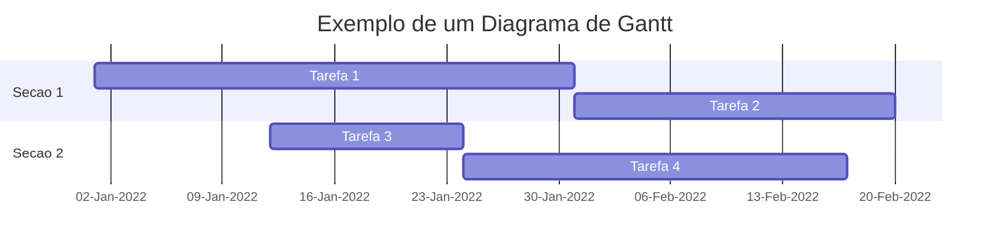
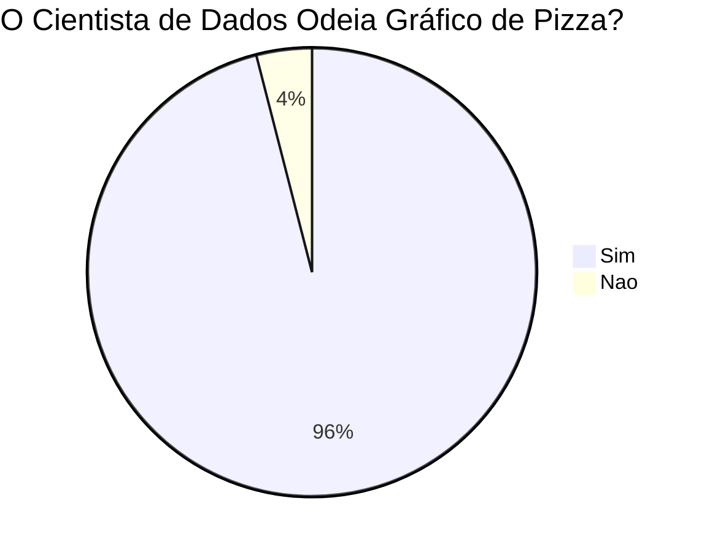

# Mermaid Code Testing

Testing some Mermaid code and functionality.

## Flowchart

```mermaid
flowchart TD
    A[Início] --> B{Esta<br>chovendo<br>hoje?}
    B --> C[Sim]
    C --> D[Pegar<br>Guarda-Chuva]
    D --> E[Fim]
    B --> G[Nao] ---> E[Fim]
```

## Class Diagram

```mermaid
classDiagram
      Veiculo <|-- Carro
      Veiculo <|-- Aviao
      Veiculo <|-- Motocicleta
      Veiculo : +int idade
      Veiculo : +int kmsRodados
      Veiculo: +estaFuncionando()
      Veiculo: +dirigir()
      class Carro{
          +String Cor
          +acelerar()
          +parar()
      }
      class Aviao{
          -int tamanhoEmMetros
          -decolar()
      }
      class Motocicleta{
          +bool estaFuncionando
          +acelerar()
      }
```

## Entity Relationship Diagram

```mermaid
erDiagram
    CLIENTE ||--o{ PEDIDO : faz
    CLIENTE {
        string nome
        string numeroDoCliente
        string setor
    }
    PEDIDO ||--|{ ITEM : contem
    PEDIDO {
        int numeroDoPedido
        string enderecoDeEntrega
    }
    ITEM {
        string codigoDoProduto
        int quantidade
        float precoUnitario
    }
```

## Gantt

```mermaid
gantt
    title Exemplo de um Diagrama de Gantt
    %% comentário
    dateFormat  DD-MM-YYYY
    axisFormat  %d-%b-%Y
    section Secao 1
    Tarefa 1        :a1, 01-01-2022, 30d
    Tarefa 2        :after a1  , 20d
    section Secao 2
    Tarefa 3        :12-01-2022  , 12d
    Tarefa 4        :24d
```

## Gráfico de Pizza

```mermaid
pie
    title O Cientista de Dados Odeia Gráfico de Pizza?
    "Sim" : 96
    "Nao" : 4
```
